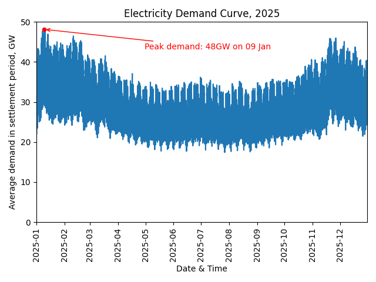
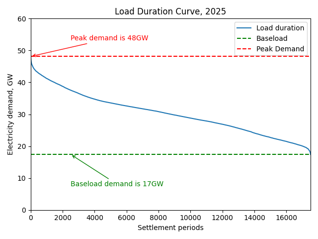
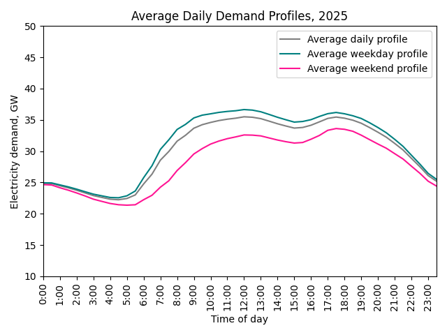
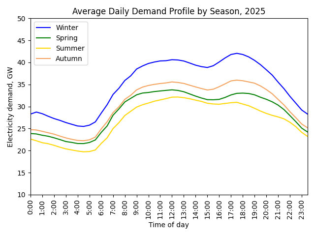
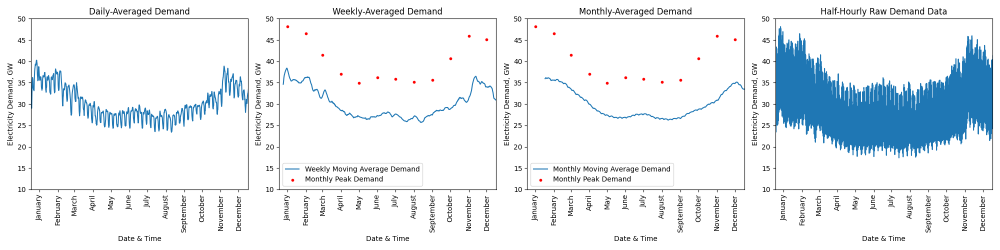

# UK Electricity Demand Analysis for 2025

## Project Overview & Data
<ins>**Aim:**</ins> Explore UK electricity demand in 2025. 

<ins>**Objectives:**</ins>
Identify:
- Daily and seasonal trends
- Peak demand
- Baseload demand 

<ins>**Data:**</ins> Half-hourly historic demand data from NESO (https://www.neso.energy/data-portal/historic-demand-data). 

## Technical Skills
<ins>**Python libraries:</ins>** matplotlib  |  pandas  

<ins>**Skills:</ins>** Hourly dataset handling  |  Datetime objects  |  Data visualisation

## Analysis
### Electricity Demand & Load Duration Curves

### Average Daily Demand Variation

### Moving Average Trend Analysis

